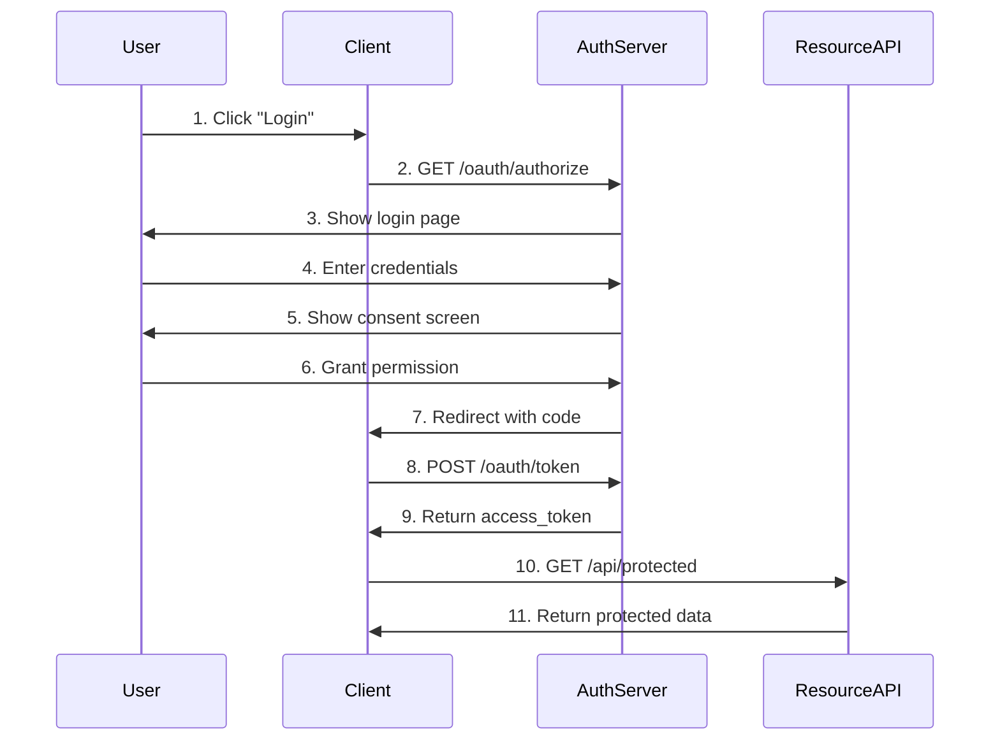
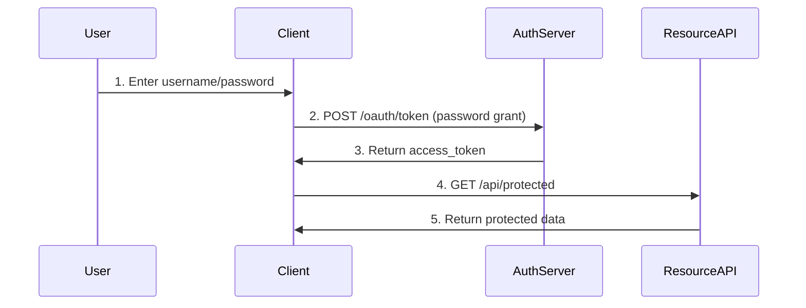

# OAuth 2.0 Authentication Guide

## Table of Contents
- [Overview](#overview)
- [Grant Types](#grant-types)
- [Authentication Flow](#authentication-flow)
- [API Endpoints](#api-endpoints)
- [Token Management](#token-management)
- [Scopes](#scopes)
- [PKCE Support](#pkce-support)
- [Client Registration](#client-registration)
- [Code Examples](#code-examples)

## Overview

This framework uses **OAuth 2.0** as the authentication and authorization protocol. OAuth 2.0 is an industry-standard protocol that provides secure delegated access.

### Key Features

- ✅ **Multiple Grant Types**: Authorization Code, Password, Refresh Token, Client Credentials
- ✅ **PKCE Support**: Enhanced security for public clients
- ✅ **Token Revocation**: RFC 7009 compliant
- ✅ **Token Introspection**: RFC 7662 compliant
- ✅ **Scope-based Access Control**: Fine-grained permissions
- ✅ **OpenID Connect Compatible**: UserInfo endpoint

### Technology Stack

- **Authlib**: Modern OAuth 2.0 library for Python
- **SQLAlchemy**: Database models for tokens and clients
- **Flask**: Web framework integration
- **PostgreSQL**: Token and user storage

## Grant Types

The framework supports four OAuth 2.0 grant types:

### 1. Authorization Code Grant (Recommended)

Best for: Web applications, mobile apps with backend

```http
# Step 1: Authorization Request
GET /oauth/authorize?
    response_type=code&
    client_id=YOUR_CLIENT_ID&
    redirect_uri=YOUR_REDIRECT_URI&
    scope=read write&
    state=random_state
```

```http
# Step 2: Token Exchange
POST /oauth/token
Content-Type: application/x-www-form-urlencoded

grant_type=authorization_code&
code=AUTHORIZATION_CODE&
redirect_uri=YOUR_REDIRECT_URI&
client_id=YOUR_CLIENT_ID&
client_secret=YOUR_CLIENT_SECRET
```

### 2. Password Grant (Resource Owner Password Credentials)

Best for: First-party applications, trusted clients

```http
POST /oauth/token
Content-Type: application/x-www-form-urlencoded

grant_type=password&
username=user@example.com&
password=user_password&
client_id=YOUR_CLIENT_ID&
client_secret=YOUR_CLIENT_SECRET&
scope=read write
```

### 3. Refresh Token Grant

Best for: Obtaining new access tokens without re-authentication

```http
POST /oauth/token
Content-Type: application/x-www-form-urlencoded

grant_type=refresh_token&
refresh_token=YOUR_REFRESH_TOKEN&
client_id=YOUR_CLIENT_ID&
client_secret=YOUR_CLIENT_SECRET
```

### 4. Client Credentials Grant

Best for: Machine-to-machine communication

```http
POST /oauth/token
Content-Type: application/x-www-form-urlencoded

grant_type=client_credentials&
client_id=YOUR_CLIENT_ID&
client_secret=YOUR_CLIENT_SECRET&
scope=read
```

## Authentication Flow

### Complete Authorization Code Flow



### Password Grant Flow (Simplified)



## API Endpoints

### Authentication Endpoints

| Endpoint | Method | Description | Authentication |
|----------|--------|-------------|----------------|
| `/oauth/register` | POST | Register new user | None |
| `/oauth/login` | POST | User login (session) | None |
| `/oauth/authorize` | GET/POST | Authorization endpoint | Session |
| `/oauth/token` | POST | Token endpoint | Client credentials |
| `/oauth/revoke` | POST | Revoke token | Client credentials |
| `/oauth/userinfo` | GET | Get user info | Bearer token |
| `/oauth/introspect` | POST | Introspect token | Client credentials |
| `/oauth/client/register` | POST | Register OAuth client | Session |
| `/oauth/client/list` | GET | List user's clients | Session |

### Protected API Endpoints

| Endpoint | Method | Required Scope | Description |
|----------|--------|----------------|-------------|
| `/api/ping` | GET | None (public) | Health check |
| `/api/status` | GET | None (public) | API status |
| `/api/protected` | GET | Any | Protected resource |
| `/api/admin` | GET | `admin` | Admin resource |
| `/api/users/me` | GET | `profile` | Current user info |

## Token Management

### Access Token

- **Type**: Bearer token
- **Default Lifetime**: 3600 seconds (1 hour)
- **Format**: Random string (UUID-based)
- **Usage**: Include in Authorization header

```http
Authorization: Bearer YOUR_ACCESS_TOKEN
```

### Refresh Token

- **Default Lifetime**: 2592000 seconds (30 days)
- **Usage**: Exchange for new access token
- **Security**: Refresh tokens are revoked after use (rotation)

### Token Response Format

```json
{
  "access_token": "eyJhbGciOiJIUzI1NiIsInR5cCI6IkpXVCJ9...",
  "token_type": "Bearer",
  "expires_in": 3600,
  "refresh_token": "def502004a0e27b5f5e8d4e8e7b1c2d3...",
  "scope": "read write"
}
```

### Token Revocation

Revoke an access or refresh token:

```http
POST /oauth/revoke
Content-Type: application/x-www-form-urlencoded

token=YOUR_TOKEN&
token_type_hint=access_token&
client_id=YOUR_CLIENT_ID&
client_secret=YOUR_CLIENT_SECRET
```

### Token Introspection

Check if a token is valid:

```http
POST /oauth/introspect
Content-Type: application/x-www-form-urlencoded

token=YOUR_ACCESS_TOKEN&
client_id=YOUR_CLIENT_ID&
client_secret=YOUR_CLIENT_SECRET
```

Response:

```json
{
  "active": true,
  "client_id": "abc123",
  "username": "john_doe",
  "scope": "read write",
  "exp": 1699999999,
  "iat": 1699996399,
  "token_type": "Bearer"
}
```

## Scopes

Scopes define the level of access granted by a token.

### Available Scopes

| Scope | Description | Example Use |
|-------|-------------|-------------|
| `read` | Read access to resources | GET requests |
| `write` | Write access to resources | POST, PUT, DELETE requests |
| `profile` | Access to user profile | User details endpoints |
| `email` | Access to user email | Email verification |
| `admin` | Administrative access | Admin-only operations |

### Using Scopes

**Request specific scopes:**

```http
GET /oauth/authorize?
    scope=read write profile&
    ...
```

**Require scopes in protected endpoints:**

```python
@api_bp.route('/data', methods=['GET'])
@require_oauth(scope='read')
def get_data(token):
    return jsonify({'data': [...]})
```

**Check token scopes:**

```python
if 'admin' in token.scope:
    # Admin-specific logic
    pass
```

## PKCE Support

Proof Key for Code Exchange (PKCE) enhances security for public clients (mobile apps, SPAs).

### PKCE Flow

**1. Generate code verifier and challenge:**

```python
import hashlib
import base64
import secrets

# Generate code verifier
code_verifier = base64.urlsafe_b64encode(
    secrets.token_bytes(32)
).decode('utf-8').rstrip('=')

# Generate code challenge
code_challenge = base64.urlsafe_b64encode(
    hashlib.sha256(code_verifier.encode()).digest()
).decode('utf-8').rstrip('=')
```

**2. Authorization request with PKCE:**

```http
GET /oauth/authorize?
    response_type=code&
    client_id=YOUR_CLIENT_ID&
    redirect_uri=YOUR_REDIRECT_URI&
    code_challenge=CODE_CHALLENGE&
    code_challenge_method=S256
```

**3. Token request with code verifier:**

```http
POST /oauth/token
Content-Type: application/x-www-form-urlencoded

grant_type=authorization_code&
code=AUTHORIZATION_CODE&
redirect_uri=YOUR_REDIRECT_URI&
client_id=YOUR_CLIENT_ID&
code_verifier=CODE_VERIFIER
```

## Client Registration

### Register User Account

```bash
curl -X POST http://localhost:8080/oauth/register \
  -H "Content-Type: application/json" \
  -d '{
    "username": "john_doe",
    "email": "john@example.com",
    "password": "secure_password123"
  }'
```

### Login to Create Session

```bash
curl -X POST http://localhost:8080/oauth/login \
  -H "Content-Type: application/json" \
  -c cookies.txt \
  -d '{
    "username": "john_doe",
    "password": "secure_password123"
  }'
```

### Register OAuth 2.0 Client

```bash
curl -X POST http://localhost:8080/oauth/client/register \
  -H "Content-Type: application/json" \
  -b cookies.txt \
  -d '{
    "client_name": "My Application",
    "redirect_uris": ["http://localhost:3000/callback"],
    "grant_types": ["authorization_code", "refresh_token"],
    "scope": "read write profile"
  }'
```

Response:

```json
{
  "client_id": "abc123def456",
  "client_secret": "xyz789uvw012",
  "client_name": "My Application",
  "redirect_uris": ["http://localhost:3000/callback"],
  "grant_types": ["authorization_code", "refresh_token"],
  "scope": "read write profile",
  "message": "Client registered successfully. Store client_secret securely!"
}
```

## Code Examples

### Python Client Example

```python
import requests

# Configuration
TOKEN_URL = 'http://localhost:8080/oauth/token'
API_URL = 'http://localhost:8080/api'
CLIENT_ID = 'your_client_id'
CLIENT_SECRET = 'your_client_secret'

# 1. Get access token using password grant
def get_token(username, password):
    response = requests.post(TOKEN_URL, data={
        'grant_type': 'password',
        'username': username,
        'password': password,
        'client_id': CLIENT_ID,
        'client_secret': CLIENT_SECRET,
        'scope': 'read write profile'
    })
    return response.json()

# 2. Make authenticated API request
def call_api(access_token):
    headers = {
        'Authorization': f'Bearer {access_token}'
    }
    response = requests.get(f'{API_URL}/protected', headers=headers)
    return response.json()

# 3. Refresh access token
def refresh_token(refresh_token):
    response = requests.post(TOKEN_URL, data={
        'grant_type': 'refresh_token',
        'refresh_token': refresh_token,
        'client_id': CLIENT_ID,
        'client_secret': CLIENT_SECRET
    })
    return response.json()

# Usage
token_data = get_token('john_doe', 'password123')
access_token = token_data['access_token']
refresh_token = token_data['refresh_token']

# Call protected endpoint
data = call_api(access_token)
print(data)

# Refresh when token expires
new_token_data = refresh_token(refresh_token)
```

### JavaScript Client Example

```javascript
// Configuration
const TOKEN_URL = 'http://localhost:8080/oauth/token';
const API_URL = 'http://localhost:8080/api';
const CLIENT_ID = 'your_client_id';
const CLIENT_SECRET = 'your_client_secret';

// 1. Get access token
async function getToken(username, password) {
  const params = new URLSearchParams({
    grant_type: 'password',
    username: username,
    password: password,
    client_id: CLIENT_ID,
    client_secret: CLIENT_SECRET,
    scope: 'read write profile'
  });

  const response = await fetch(TOKEN_URL, {
    method: 'POST',
    headers: {
      'Content-Type': 'application/x-www-form-urlencoded'
    },
    body: params
  });

  return await response.json();
}

// 2. Make authenticated API request
async function callAPI(accessToken) {
  const response = await fetch(`${API_URL}/protected`, {
    headers: {
      'Authorization': `Bearer ${accessToken}`
    }
  });

  return await response.json();
}

// 3. Refresh token
async function refreshToken(refreshToken) {
  const params = new URLSearchParams({
    grant_type: 'refresh_token',
    refresh_token: refreshToken,
    client_id: CLIENT_ID,
    client_secret: CLIENT_SECRET
  });

  const response = await fetch(TOKEN_URL, {
    method: 'POST',
    headers: {
      'Content-Type': 'application/x-www-form-urlencoded'
    },
    body: params
  });

  return await response.json();
}

// Usage
(async () => {
  const tokenData = await getToken('john_doe', 'password123');
  const data = await callAPI(tokenData.access_token);
  console.log(data);
})();
```

### cURL Examples

**Password Grant:**

```bash
curl -X POST http://localhost:8080/oauth/token \
  -d "grant_type=password" \
  -d "username=john_doe" \
  -d "password=password123" \
  -d "client_id=YOUR_CLIENT_ID" \
  -d "client_secret=YOUR_CLIENT_SECRET" \
  -d "scope=read write"
```

**Call Protected Endpoint:**

```bash
curl -X GET http://localhost:8080/api/protected \
  -H "Authorization: Bearer YOUR_ACCESS_TOKEN"
```

**Refresh Token:**

```bash
curl -X POST http://localhost:8080/oauth/token \
  -d "grant_type=refresh_token" \
  -d "refresh_token=YOUR_REFRESH_TOKEN" \
  -d "client_id=YOUR_CLIENT_ID" \
  -d "client_secret=YOUR_CLIENT_SECRET"
```

## Security Best Practices

### Client Security

1. **Store client_secret securely**: Never commit to version control
2. **Use HTTPS in production**: Encrypt all communication
3. **Implement PKCE**: For public clients (mobile, SPA)
4. **Validate redirect_uri**: Prevent open redirect vulnerabilities
5. **Use state parameter**: Prevent CSRF attacks

### Token Security

1. **Short-lived access tokens**: Default 1 hour
2. **Rotate refresh tokens**: New refresh token on each use
3. **Revoke tokens on logout**: Clean up unused tokens
4. **Secure token storage**: Use secure storage mechanisms
5. **Don't expose tokens**: Never log or expose in URLs

### Server Security

1. **Rate limiting**: Prevent brute force attacks
2. **CORS configuration**: Restrict allowed origins
3. **TLS/SSL**: Always use HTTPS in production
4. **Input validation**: Sanitize all user input
5. **Audit logging**: Track authentication events

## Environment Configuration

Update your `.env` file:

```bash
# OAuth 2.0 Configuration
OAUTH2_ISSUER=https://your-domain.com
OAUTH2_ACCESS_TOKEN_EXPIRES=3600
OAUTH2_REFRESH_TOKEN_EXPIRES=2592000
OAUTH2_AUTHORIZATION_CODE_EXPIRES=600
```

## Database Migrations

Run migrations to create OAuth 2.0 tables:

```bash
# Initialize migrations
docker-compose exec api flask db init

# Create migration
docker-compose exec api flask db migrate -m "Add OAuth 2.0 tables"

# Apply migration
docker-compose exec api flask db upgrade
```

## Troubleshooting

### Common Issues

**Invalid client error:**
- Verify client_id and client_secret
- Check client is registered in database

**Invalid grant error:**
- Check authorization code hasn't expired
- Verify redirect_uri matches original request

**Insufficient scope error:**
- Request appropriate scopes
- Check endpoint required scopes

**Token expired:**
- Use refresh token to get new access token
- Re-authenticate if refresh token expired

### Debug Mode

Enable debug logging in `.env`:

```bash
DEBUG=True
FLASK_ENV=development
```

## Migration from JWT

If migrating from JWT to OAuth 2.0:

1. **Update dependencies**: Install Authlib, remove Flask-JWT-Extended
2. **Run migrations**: Create OAuth 2.0 database tables
3. **Update endpoints**: Change authentication decorators
4. **Update clients**: Implement OAuth 2.0 flows
5. **Test thoroughly**: Verify all authentication flows

See [MIGRATION.md](MIGRATION.md) for detailed migration guide.

## Additional Resources

- [OAuth 2.0 RFC 6749](https://tools.ietf.org/html/rfc6749)
- [PKCE RFC 7636](https://tools.ietf.org/html/rfc7636)
- [Token Revocation RFC 7009](https://tools.ietf.org/html/rfc7009)
- [Token Introspection RFC 7662](https://tools.ietf.org/html/rfc7662)
- [Authlib Documentation](https://docs.authlib.org/)
